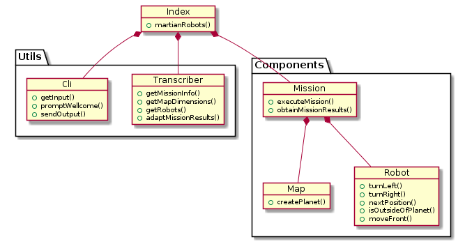

# Martian robots

The project instructions are [here](instructions.md)

## Install this project

Clone the project, change into the directory and install the dependencies.

```bash
git clone https://github.com/reymon359/martian-robots
cd martian-robots
npm install
```
## Project Structure

Here is the final structure of the project



## Run the project

Run the NodeJs application with the command:

```bash
npm start
```


You will be asked to write in the terminal the input.

## Test the project

Launch the test runner in the interactive watch mode.

```bash
npm test
```


See the full the test coverage.

```bash
npm test -- --coverage
```

